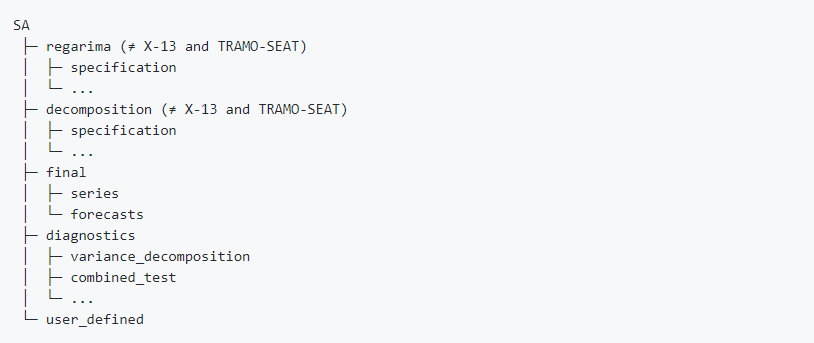

#### Create moving averages

```{r, echo = TRUE, eval = FALSE}
library("rjd3filters")

m1 <- moving_average(rep(1, 3), lags = 1)
m1 # Forward MA
m2 <- moving_average(rep(1, 3), lags = -1)
m2 # centred MA

m1 + m2
m1 - m2
m1 * m2
```

Can be used to create all the MA of X-11:

```{r, echo = TRUE, eval = FALSE}
e1 <- moving_average(rep(1, 12), lags = -6)
e1 <- e1 / sum(e1)
e2 <- moving_average(rep(1 / 12, 12), lags = -5)

# used to have the 1rst estimate of the trend
tc_1 <- M2X12 <- (e1 + e2) / 2
coef(M2X12) |> round(3)
si_1 <- 1 - tc_1
M3 <- moving_average(rep(1 / 3, 3), lags = -1)
M3X3 <- M3 * M3

# M3X3 moving average applied to each month
coef(M3X3) |> round(3)
M3X3_seasonal <- to_seasonal(M3X3, 12)
coef(M3X3_seasonal) |> round(3)
s_1 <- M3X3_seasonal * si_1
s_1_norm <- (1 - M2X12) * s_1
sa_1 <- 1 - s_1_norm
henderson_mm <- moving_average(lp_filter(horizon = 6)$filters.coef[, "q=6"],
    lags = -6
)
tc_2 <- henderson_mm * sa_1
si_2 <- 1 - tc_2
M5 <- moving_average(rep(1 / 5, 5), lags = -2)
M5X5_seasonal <- to_seasonal(M5 * M5, 12)
s_2 <- M5X5_seasonal * si_2
s_2_norm <- (1 - M2X12) * s_2
sa_2 <- 1 - s_2_norm
tc_f <- henderson_mm * sa_2
```

```{r, eval=FALSE, x11Filters,out.height="90%"}
par(mai = c(0.3, 0.3, 0.2, 0))
layout(matrix(c(1, 1, 2, 3), 2, 2, byrow = TRUE))

plot_coef(tc_f)
plot_coef(sa_2, col = "orange", add = TRUE)
legend("topleft",
    legend = c("Final TC filter", "Final SA filter"),
    col = c("black", "orange"), lty = 1
)

plot_gain(tc_f)
plot_gain(sa_2, col = "orange", add = TRUE)

plot_phase(tc_f)
plot_phase(sa_2, col = "orange", add = TRUE)
```

#### Apply a moving average

```{r, eval=FALSE, exApply,out.height="70%"}
y <- retailsa$AllOtherGenMerchandiseStores
trend <- y * tc_1
sa <- y * sa_1
plot(window(ts.union(y, trend, sa), start = 2000),
    plot.type = "single",
    col = c("black", "orange", "lightblue")
)
```

### ggdemetra3


```{r ggdemetra3, out.height="85%", eval=FALSE,message = FALSE, warning = FALSE}
remotes::install_github("AQLT/ggdemetra3")
library("ggdemetra3")

spec <- spec_x13_default("rsa3") |> set_tradingdays(option = "WorkingDays")
p_ipi_fr <- ggplot(data = ipi_c_eu_df, mapping = aes(x = date, y = FR)) +
    geom_line() +
    labs(
        title = "SA - IPI-FR",
        x = NULL, y = NULL
    )
p_sa <- p_ipi_fr +
    geom_sa(
        component = "y_f(12)", linetype = 2,
        spec = spec
    ) +
    geom_sa(component = "sa", color = "red") +
    geom_sa(component = "sa_f", color = "red", linetype = 2)
p_sa
p_sa +
    geom_outlier(
        geom = "label_repel",
        coefficients = TRUE,
        ylim = c(NA, 65), force = 10,
        arrow = arrow(
            length = unit(0.03, "npc"),
            type = "closed", ends = "last"
        ),
        digits = 2
    )
```

## rjd3 suite of packages: overview

The sections below provide an overview of each package based on version 3.x of JDemetra+. For detailed description refer to the package's own R Readme file and documentation pages as linked below.

### rjd3toolkit

Contains utility functions used in other `rjd3` packages and has to be systematically installed before using any other rjd3 package. From a user point of view, it allows to:

-   customize specifications in rjd3x13 and rjd3tramoseats

-   generate user-defined regressors for calendar correction

-   generate auxiliary variables (outliers, ramps..)

-   run ARIMA model estimations

-   perform tests (seasonality, normality, white noise)

-   access general functions such as autocorrelations, distributions

Documentation [here](https://rjdverse.github.io/rjd3toolkit)

### rjd3x13

`rjd3x13` gives access to X-13-ARIMA seasonal adjustment algorithm.

-   Specification: created with `spec_x11_default()`, `spec_x13_default()`, `spec_regarima_default()` and customized with `rjd3toolkit` functions + `set_x11()`

-   Apply model with `x11()`, `x13()`, `fast.x13()`, `regarima()`, `fast.regarima()`

-   Refresh policies: `regarima.refresh()` and `x13.refresh()`

Documentation [here](https://rjdverse.github.io/rjd3x13)

### rjd3tramoseats

`rjd3tramoseats` gives access to Tramo-Seats seasonal adjustment algorithm.

-   Specification: created with `spec_tramoseats_default()`, `spec_tramo_default()` and customized with `rjd3toolkit` functions + `set_seats()`

-   Apply model with `tramoseats()`, `fast.tramoseats()`, `tramo()`, `fast.tramo()`

-   Refresh policies: `tramo.refresh()` and `tramoseats.refresh()`

Documentation [here](https://rjdverse.github.io/rjd3tramoseats)

### rjd3sts

Gives access to structural time series and state space models.

Documentation [here](https://rjdverse.github.io/rjd3sts)

<!-- Several examples available: replace by wiki link [here](??)-->

### rjd3highfreq

Depends on `rjd3sts`

Seasonal adjustment of high frequency (infra-monthly) data:

-   fractional airline based reg-ARIMA pre-adjustment

-   fractional and multi airline decomposition

Documentation [here](https://rjdverse.github.io/rjd3highfreq)

### rjd3filters

The rjd3filters package allows to:

-   easily create/combine/apply moving averages `moving_average()` (much more general than `stats::filter()`) and study their properties: plot coefficients (`plot_coef()`), gain (`plot_gain()`), phase-shift (`plot_phase()`) and different statics (`diagnostic_matrix()`)

-   trend-cycle extraction with different methods to treat endpoints:

-   `lp_filter()` local polynomial filters of Proietti and Luati (2008) (including Musgrave): Henderson, Uniform, biweight, Trapezoidal, Triweight, Tricube, "Gaussian", Triangular, Parabolic (= Epanechnikov)\

-   `rkhs_filter()` Reproducing Kernel Hilbert Space (RKHS) of Dagum and Bianconcini (2008) with same kernels\

-   `fst_filter()` FST approach of Grun-Rehomme, Guggemos, and Ladiray (2018)\

-   `dfa_filter()` derivation of AST approach of Wildi and McElroy (2019)

-   change the filter used in X-11 for TC extraction

Documentation [here](https://rjdverse.github.io/rjd3filters)

### rjd3x11plus

Depends on `rjd3filters`

-   Extension of X-11 decomposition with multiple non integer periodicities

-   Trend estimation with local polynomial based filters

Documentation [here](https://rjdverse.github.io/rjd3x11plus)

### rjd3stl

`rjd3stl` contains usual STL functions and an airline model based pre-adjustment module. Is also tailored to handle high-frequency data.

Documentation [here](https://rjdverse.github.io/rjd3stl)

### rjd3bench

Tailored for Benchmarking and temporal disaggregation

Documentation [here](https://rjdverse.github.io/rjd3bench)

### rjd3revisions

Revision analysis, more information [here](#a-revs)

<!-- ### rjd3providers -->

<!-- ### rjd3workspace -->

<!-- This package allows to wrangle JDemetra+ workspaces in R with functions: -->

<!-- -   `load_workspace` -->

<!-- -   `save_workspace` -->

<!-- Up coming content. -->

### ggdemetra3

ggdemetra3 uses ggplot2 to add seasonal adjustment statistics to your plot (like `ggdemetra` but compatible with version 3.x.). Also compatible with high-frequency methods.

Documentation and examples [here](https://github.com/AQLT/ggdemetra3)

## General structure

The R object resulting from an estimation is a list of lists containing raw data, parameters, output series and diagnostics.

### RJDemetra output structure {#t-r-packs-rjdv2-structure}

Organised by domain:



To retrieve any element just navigate this list of lists.

### rjd3x13 output structure {#t-r-packs-rjd3x13-structure}

Results and specification are separated first and then organised by domain.

```{r, echo = TRUE, eval = FALSE}
sa_x13_v3 <- RJDemetra::x13(y_raw, spec = "RSA5")
sa_x13_v3$result
sa_x13_v3$estimation_spec
sa_x13_v3$result_spec
sa_x13_v3$user_defined
```

To retrieve any element just navigate this list of lists.


