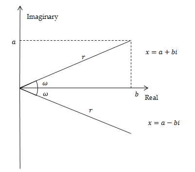
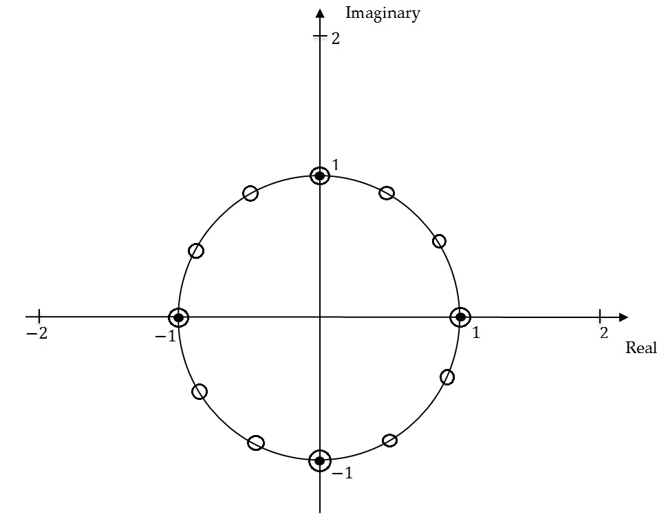
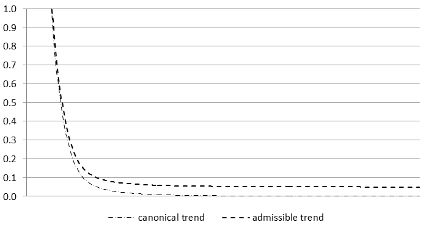
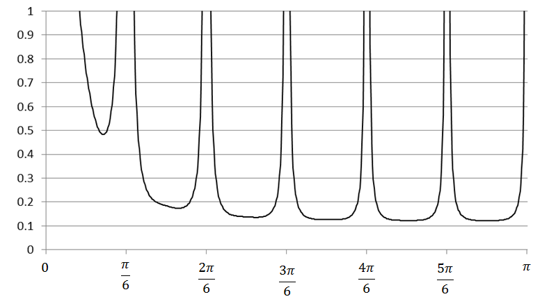
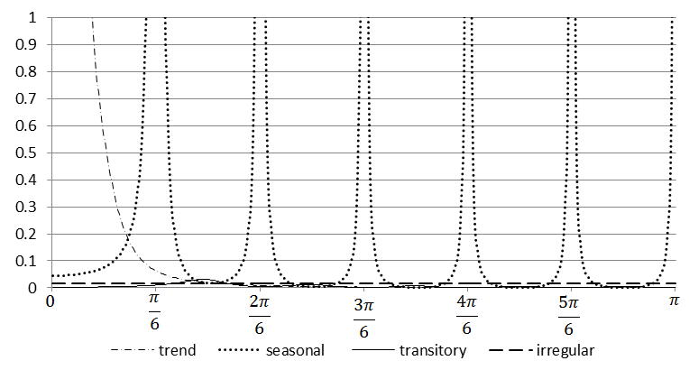

### Factorisation of AR polynomials 

here all root related explanation not directly useful ? 
in seats chapter directly factorize AR

<!-- Description based on KAISER, R., and MARAVALL, A. (2000) and MARAVALL, A. (2008c). -->

@eq-2 can be expressed as:

$$
\psi^{- 1}(B)x_{t} = a_{x,t}(1 + \varphi_{1}B + \ldots\varphi_{p}B^{p})x_{t} =(1 + \theta_{1}B + \ldots\theta_{q}B^{q})a_{x,t}
$$ {#eq-8}

Let us now consider @eq-2 in the inverted form:

$$
\theta(B)y_{t} = \varphi(B)a_{x,t}
$$ {#eq-9}

If both sides of @eq-8 multiplied by $x_{t-k}$ with $k > q$, and expectations are taken, the right hand side of the equation vanishes and the left hand side becomes:

$$
\varphi(B)\gamma_{k} = \gamma_{k} + \varphi_{1}\gamma_{k-1} + \ldots\varphi_{p}\gamma_{k-p} = 0
$$ {#eq-10}

where $B$ operates on the subindex $k$.

The autocorrelation function $\gamma_{k}$ is a solution of @eq-10 with the characteristic equation:

$$
z^{p} +\varphi_{1}z^{p-1} + \ldots\varphi_{p-1}z + \varphi_{p} = 0
$$ {#eq-11}

If $z_{1}$,...,$\ z_{p}$ are the roots of @eq-11, the solutions of @eq-10 can be expressed as:

$$
\gamma_{k} = \sum_{i = 1}^{p}z_{i}^{k}
$$ {#eq-12}

and will converge to zero as $karrow \infty$ when $|r_{i}| < 1,\ i = 1,\ldots,p$. From @eq-10 and @eq-12 it can be noticed that $z_{1} = B_{i}^{-1}$, meaning that $z_{1}$,...,$\ z_{p}$ are the inverses of the roots $B_{1},\ldots,B_{p}$ of the polynomial $\varphi(B)$. The convergence of $\gamma_{k}$ implies that the roots of the $\varphi(B)$ are larger than 1 in modulus (lie outside the unit circle). Therefore, from the @eq-13.

$$
{\varphi(B)}^{- 1} = \frac{1}{(1-z_{1})\ldots(1-z_{1})}
$$ {#eq-13}

it can be derived that ${\varphi(B)}^{- 1}$ is convergent and all its inverse roots are less than 1 in modulus.

@eq-11 has real and complex roots (solutions). Complex number $x = a + bi$, with $a$ and $\text{b}$ both real numbers, can be represented as $x = r(cos(\omega) + i\ sin(\omega))$, where $i$ is the imaginary unit ${i}^{2}=-1)$, $r$ is the modulus of $x$, that is $r=|x| = \sqrt{a^{2} + b^{2}}$ and $\omega$ is the argument (frequency). When roots are complex, they are always in pairs of complex conjugates. The representation of the complex number $x = a + bi$ has a geometric interpretation in the complex plane established by the real axis and the orthogonal imaginary axis.

Representing the roots of the characteristic @eq-11 in the complex plane enhances understanding how they are allocated to the components. When the modulus $r$ of the roots in $\text{z}$ are greater than 1 (i.e. modulus of the roots in $\varphi(B)< 1$), the solution of the characteristic equation has a systematic explosive process, which means that the impact of the given impulse on the time series is more and more pronounced in time. This behaviour is not in line with the developments that can be identified in actual economic series. Therefore, the models estimated by Tramo-Seats (and X-13ARIMA-Seats) have never inverse roots in $B$ with modulus greater than 1.

The characteristic equations associated with the regular and the seasonal differences have roots in $\varphi(B)$ with modulus $r = 1$. They are called non-stationary roots and can be represented on the unit circle. Let us consider the seasonal differencing operator applied to a quarterly time series $(1-B^{4})$. Its characteristic equation is ${(z}^{4}-1) = 0$ with solutions given by$z = \sqrt[4]{1}$, i.e. $z_{1,2} = \pm 1$ and $z_{3,4} = \pm i1$. The first two solutions are real and the last two are complex conjugates. They are represented by the black points on the unit circle on the figure below.

For the seasonal differencing operator $(1-B^{12})$ applied to the monthly time series the characteristic equation ${(z}^{12}-1) = 0$ has twelve non-stationary solutions given by $z = \sqrt[12]{1}:$ two real and ten complex conjugates, represented by the white circles in unit roots figure above.

The complex conjugates roots generate the periodic movements of the type:

$$
z_{t} = A^{t}\cos(\omega t + W)
$$ {#eq-14}

where:

-   $A$ -- amplitude;

-   $\omega$ -- angular frequency (in radians);

-   $W$ -- phase (angle at $t = 0)$.

The frequency $f$, i.e. the number of cycles per unit time, is $\frac{\omega}{2\pi}$. If it is multiplied by *s*, the number of observations per year, the number of cycles completed in one year is derived. The period of function in @eq-14, denoted by $\tau$, is the number of units of time (months/quarters) it takes for a full circle to be completed.

For quarterly series the seasonal movements are produced by complex conjugates roots with angular frequencies at $\frac{\pi}{2}$ (one cycle per year) and $\pi$ (two cycles per year). The corresponding number of cycles per year and the length of the movements are presented in the table below.

**Seasonal frequencies for a quarterly time series**

| **Angular frequency (**$\omega$) | **Frequency (cycles per unit time) (**$f$) | **Cycles per year** | **Length of the movement measured in quarters (**$\tau$) |
|------------------|------------------|------------------|-------------------|
| $\frac{\pi}{2}$                  | 0.25                                       | 1                   | 4                                                        |
| $\pi$                            | 0.5                                        | 2                   | 2                                                        |

For monthly time series the seasonal movements are produced by complex conjugates roots at the angular frequencies: $\frac{\pi}{6},\frac{\pi}{3}, \frac{\pi}{2}, \frac{2\pi}{3}, \frac{5\pi}{6}$ and $\pi$. The corresponding number of cycles per year and the length of the movements are presented in the table below:

**Seasonal frequencies for a monthly time series**

| **Angular frequency (**$\omega$) | **Frequency (cycles per time unit) (**$f$) | **Cycles per year** | **Length of the movement measured in months (**$\tau$) |
|-----------------|-------------------|-----------------|-------------------|
| $\frac{\pi}{6}$                  | 0.083                                      | 1                   | 12                                                     |
| $\frac{\pi}{3}$                  | 0.167                                      | 2                   | 6                                                      |
| $\frac{\pi}{2}$                  | 0.250                                      | 3                   | 4                                                      |
| $\frac{2\pi}{3}$                 | 0.333                                      | 4                   | 3                                                      |
| $\frac{5\pi}{6}$                 | 0.417                                      | 5                   | 2.4                                                    |
| $\pi$                            | 0.500                                      | 6                   | 2                                                      |

In JDemetra+ Seats assigns the roots of the AR full polynomial to the components according to their associated modulus and frequency (For details see MARAVALL, A., CAPORELLO, G., PÉREZ, D., and LÓPEZ, R. (2014))

-   Roots of $(1-B)^{d}$ are assigned to trend component.

-   Roots of $(1-B^{s})^{d_{s}} = {((1-B)(1+B + \ldots + B^{s-1}))}^{d_{s}}$ are assigned to the trend component (root of ${(1-B)}^{d_{s}}$) and to the seasonal component (roots of ${(1+B + \ldots + B^{s-1})}^{d_{s}}$).

-   When the modulus of the inverse of a real positive root of $\varphi(B)$ is greater than $k$ or equal to $k$, where $k$ is the threshold value controlled by the *Trend boundary* parameter, then the root is assigned to the trend component. Otherwise it is assigned to the transitory component.

-   Real negative inverse roots of $\text{ϕ}_{p}(B)$ associated with the seasonal two-period cycle are assigned to the seasonal component if their modulus is greater than *k*, where $k$ is the threshold value controlled by the *Seasonal boundary* and the *Seas. boundary (unique)* parameters. Otherwise they are assigned to the transitory component.

-   Complex roots, for which the argument (angular frequency) is close enough to the seasonal frequency are assigned to the seasonal component. Closeness is controlled by the *Seasonal tolerance* and *Seasonal tolerance (unique)* parameters. Otherwise they are assigned to the transitory component.

-   If $d_{s}$ (seasonal differencing order) is present and $\text{Bphi} < 0$ ($\text{Bphi}$ is the estimate of the seasonal autoregressive parameter), the real positive inverse root is assigned to the trend component and the other ($s-1$) inverse roots are assigned to the seasonal component. When $d_{s} = 0$, the root is assigned to the seasonal when $\text{Bphi} < - 0.2$ and/or the overall test for seasonality indicates presence of seasonality. Otherwise it goes to the transitory component. Also, when $\text{Bphi} > 0$, roots are assigned to the transitory component.

It should be highlighted that when $Q > P$, where $Q$ and $P$ denote the orders of the polynomials $\varphi(B)$ and $\theta(B)$, the Seats decomposition yields a pure MA $(Q - P)$ component (hence transitory). In this case the transitory component will appear even when there is no AR factor allocated to it.

Once these rules are applied, the factorization of the AR polynomial presented by @eq-2 yields to the identification of the AR polynomials for the components which contain, respectively, the AR roots associated with the trend component, the seasonal component and the transitory component.

The AR roots close to or at the trading day frequency generates a stochastic trading day component. A stochastic trading day component is always modelled as a stationary ARMA(2,2), where the AR part contains the roots close to the TD frequency, and the MA(2) is obtained from the model decomposition (MARAVALL, A., and PÉREZ, D. (2011)). This component, estimated by Seats, is not implemented by the current version of JDemetra+.

Then with the partial fraction expansion the spectrum of the final components are obtained.

For example, the Airline model for a monthly time series:

$$
(1-B)(1-B^{12})x_{t} = (1+\theta_{1}B)(1+\Theta_{1}B^{12})\ a_{x,t}
$$ {#eq-15}

is decomposed by Seats into the model for the trend component:

$$
(1-B)(1-B)c_{t} =(1+\theta_{c,1}B + \theta_{c,2}B^{2})a_{c,t}
$$ {#eq-16}

and the model for the seasonal component:

$$
(1+B + \ldots + B^{11})s_{t} = (1+\theta_{s,1}B + \ldots + {\theta_{s,11}B}^{11})a_{s,t},
$$ {#eq-17}

As a result, the Airline model is decomposed as follows: 

$$
\small
\frac{(1+\theta_{1}B)(1+\Theta_{1}B^{12})}{(1-B)(1-B)}a_{x,t} = \frac{(1+\theta_{s,1}B + \ldots + {\theta_{s,11}B}^{11})}{(1+B + \ldots + B^{11})}a_{s,t} + \frac{(1+\theta_{c,1}B + \theta_{c,2}B^{2})}{(1-B)(1-B)}a_{c,t} + u_{t}
$$ {#eq-18}

The transitory component is not present in this case and the irregular component is the white noise.

The partial fractions decomposition is performed in a frequency domain. In essence, it consists in portioning of the pseudo-spectrum of $x_{t}$ into additive spectra of the components. When the AMB decomposition of the ARIMA model results in the non-negative spectra for all components, the decomposition is called admissible. In such case an infinite number of admissible decompositions exists, i.e. decompositions that yield the non-negative spectra of all components.

Therefore, the MA polynomials and the innovation variances cannot be yet identified from the model of $x_{t}$. As sketched above, to solve this under identification problem and identify a unique decomposition, it is assumed that for each component the order of the MA polynomial is no greater than the order of the AR polynomial and the canonical solution of S.C. Hillmer and G.C. Tiao is applied, i.e. all additive white noise is added to the irregular component As a consequence all components derived from the canonical decomposition, except from the irregular, have a spectral minimum of zero and are thus non invertible.

Given the stochastic features of the series, it can be shown by that the canonical decomposition produces as stable as possible trend and seasonal components since it maximizes the variance of the irregular and minimizes the variance of the other components. However, there is a price to be paid as canonical components can produce larger revisions in the preliminary estimators of the component than any other admissible decomposition.

The term pseudo-spectrum is used for a non-stationary time series, while the term spectrum is used for a stationary time series.

If the ARIMA model estimated in Tramo does not accept an admissible decomposition, Seats replaces it with a decomposable approximation. The modified model is therefore used to decompose the series. There are also other rare situations when the ARIMA model chosen by Tramo is changed by Seats. It happens when, for example, the ARIMA models generate unstable seasonality or produce a senseless decomposition. Such examples are discussed by MARAVALL, A. (2009).

HILLMER, S.C., and TIAO, G.C. (1982).

GÓMEZ, V., and MARAVALL, A. (2001a).

HILLMER, S.C., and TIAO, G.C. (1982).

MARAVALL, A. (1986).

The figure below represents the pseudo-spectrum for the canonical trend and an admissible trend.

A pseudo-spectrum is denoted by$g_{i}(\omega)$, where $\omega$ represents the angular frequency. The pseudo-spectrum of $x_{\text{it}}$ is defined as the Fourier transform of ACGF of $x_{t}$ which is expressed as:

$$
\frac{\psi_{i}(B)\psi_{i}(F)}{\delta_{i}(B)\delta_{i}(F)}V(a_{i})
$$ {#eq-19}

where:

-   $\psi_{i}(F) = \frac{\theta_{i}(F)}{\phi_{i}(F)}$

-   $\psi_{i}(B) = \frac{\theta_{i}(B)}{\phi_{i}(B)}$

A pseudo-spectrum for a monthly time series $x_{t}$ is presented in the figure below: The pseudo-spectrum for a monthly series. The frequency $\omega = 0$ is associated with the trend, frequencies in the range $[0 + \epsilon_{1},\ \frac{\pi}{6} - \epsilon_{2}]$ with $[0 + \epsilon_{1},\ \frac{\pi}{6} - \epsilon_{2}]$ $\epsilon_{1},\ \epsilon_{2} > 0$ and $\epsilon_{1} < \ \frac{\pi}{6} - \epsilon_{2}$ are usually associated with the business-cycle and correspond to a period longer than a year and bounded.

The frequencies in the range $[\frac{\pi}{6},\pi]$ are associated with the short term movements, whose cycle is completed in less than a year. If a series contains an important periodic component, its spectrum reveals a peak around the corresponding frequency and in the ARIMA model it is captured by an AR root. In the example below spectral peaks occur at the frequency $\omega = 0$ and at the seasonal frequencies ($\frac{\pi}{6}$, $\frac{2\pi}{6},\ \frac{3\pi}{6},\ \frac{4\pi}{6},\frac{5\pi}{6},\pi$).

In the decomposition procedure, the pseudo-spectrum of the time series $x_{t}$ is divided into the spectra of its components (in the example figure below, four components were obtained).

